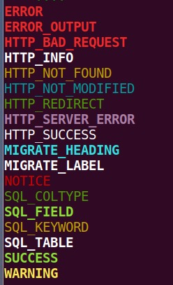

**Xiang Wang @ 2017-02-09 13:49:33**

# example
* [official document](https://docs.djangoproject.com/en/1.11/howto/custom-management-commands/)

```
from django.core.management.base import BaseCommand, CommandError
from polls.models import Question as Poll

class Command(BaseCommand):
    help = 'Closes the specified poll for voting'

    def add_arguments(self, parser):
        parser.add_argument('poll_id', nargs='+', type=int)
        parser.add_argument('-max', type=int, default=150, help="一次性推送允许的最多人数")  #  带有默认值的参数. 可以传可以不传

    def handle(self, *args, **options):
        assert isInstance(options["max"], int)
        for poll_id in options['poll_id']:
            try:
                poll = Poll.objects.get(pk=poll_id)
            except Poll.DoesNotExist:
                raise CommandError('Poll "%s" does not exist' % poll_id)

            poll.opened = False
            poll.save()

            self.stdout.write(self.style.SUCCESS('Successfully closed poll "%s"' % poll_id))
```


## beautify output
`self.stdout.write(self.style.SUCCESS('operate success'))`  


